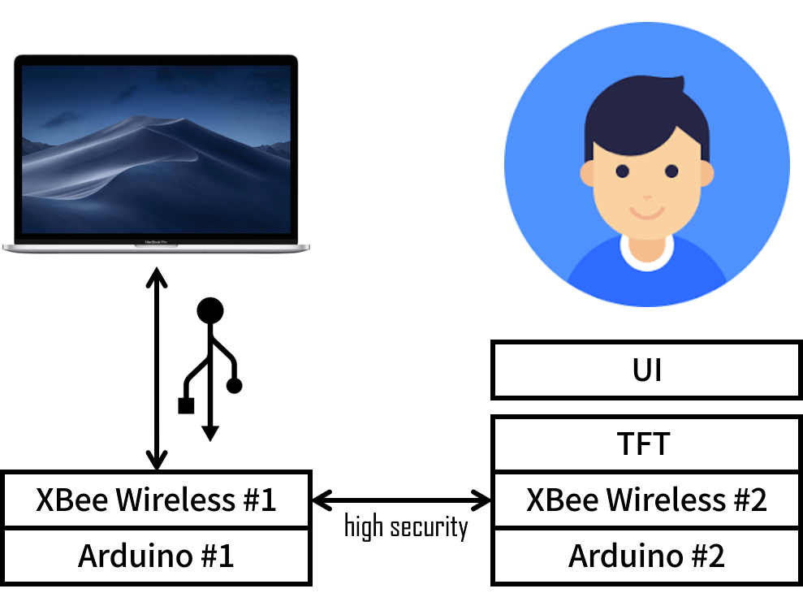

# CommanderPass
CommanderPass is an authenticator to verify user who has permission to access the secret files.  
The project is created for building an authentication system with more secure.  

[Web App Example](http://fang2hou.github.io/CommanderPass)

# How to use
## The things you need
### Hardware
1. Arduino x 2
2. XBee S1 x 2 (paired)
3. 2.8' Adafruit TFT Touchscreen
4. A Mac installed macOS 12.12+

### Software
1. Go-lang enviroment
2. Web Browser
3. Cocoapod
4. Xcode
5. Arduino IDE

## System Design


## Build
1. Use Arduino IDE to build Sender and User code and upload to each Arduino.
2. Use cocoapod to install frameworks.
    ```shell
    cd Client && pod install
    ```
3. Use XCode to build & run.
4. Start server.
    ```shell
    cd Server && go build server.go && ./server
    ```
5. Open `index.html` inside `Web` directory.

# Author
Students from Ritsumeikan University Course: "Topic in IT 4"  
Zhou Fang, Junjie Xu, Yizhe Ruan @ 2019.1
